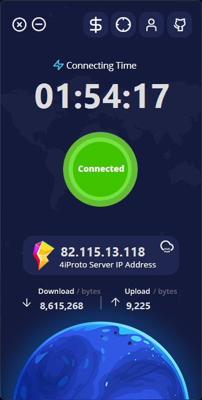
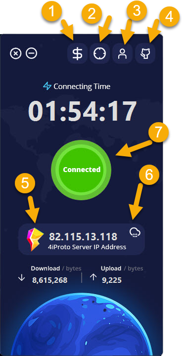

# کلاینت Abdal 4iProto

**کلاینتی امن، سریع و هوشمند برای تونل‌سازی SSH — دسترسی رمزنگاری‌شده به اینترنت با Abdal 4iProto Client**

  

## 📘 زبان‌های دیگر

- [🇬🇧 English - انگلیسی](README.md)

---

کلاینت Abdal 4iProto یک نرم‌افزار دارای رابط گرافیکی (GUI) با پشتیبانی کامل از ویندوز است که مبتنی بر پروتکل اختصاصی 4iProto (بر پایه‌ی SSH) طراحی شده. این کلاینت با اتصال به Abdal 4iProto Server یک پراکسی داخلی از نوع SOCKS5 روی پورت پیش‌فرض `52905` راه‌اندازی می‌کند و تمام ترافیک سیستم را از طریق تونل امن عبور می‌دهد.

---

## 🚀 امکانات

- 🔐 **پروتکل 4iProto**: کاملاً رمزنگاری‌شده و ایمن
- 🌐 **پراکسی داخلی SOCKS5**: راه‌اندازی خودکار پس از اتصال موفق
- 🖥️ **رابط کاربری مدرن**: زیبا و مانیتورینگ بلادرنگ
- 💻 **پشتیبانی کامل از ویندوز**
- ⚙️ **بدون نیاز به دکمه ذخیره**: تنظیمات مثل لیست استثنا به‌صورت خودکار ذخیره می‌شوند
- 🚫 **لیست سایت‌های مستثنا از تونل**: برای عبور مستقیم بدون استفاده از تونل
- 📊 **نمایش زنده ترافیک و زمان اتصال**
- 🔄 **اتصال و قطع اتصال با یک کلیک**
- 👨‍💻 **دسترسی به اطلاعات سازنده و مخزن گیت‌هاب**
- 💰 **دسترسی به صفحه حمایت مالی درون برنامه**
- 🔁 **اتصال خودکار**: در صورت قطع شدن اینترنت یا ارتباط با سرور، تلاش می‌کند دوباره به‌صورت خودکار وصل شود.
- 🔊 **افکت‌های صوتی علمی و فضایی**: استفاده از صداهای الهام‌گرفته از دنیای Sci-Fi برای خطاها، رویدادها و وضعیت‌های مختلف.
- 🔗 قابلیت Port Forwarding

---

## 🧩 راهنمای اجزای رابط کاربری

  

1. **دکمه حمایت مالی**: باز کردن صفحه پرداخت  
2. **مانیتورینگ**: نمایش وضعیت اتصال و ترافیک  
3. **درباره و تماس**: اطلاعات تماس با توسعه‌دهنده  
4. **لینک گیت‌هاب**: رفتن به مخزن گیت‌هاب  
5. **ورود اطلاعات سرور و تنظیم پورت پراکسی**  
6. **لیست سایت‌های مستثنا از تونل** (ذخیره خودکار)  
7. **دکمه اتصال/قطع اتصال**  

---

## 📥 نصب

نرم‌افزار دارای نصب‌کننده (Setup) چندزبانه است.  
برای نصب، لطفاً آخرین نسخه را از لینک زیر دریافت کرده و اجرا کنید:  
👉 [دریافت از GitHub Releases](https://github.com/ebrasha/abdal-4iproto-client/releases)

--- 

## ⚙️ نحوه عملکرد

پس از نصب و اجرای برنامه:

1. به سرور Abdal 4iProto متصل می‌شود.
2. یک پراکسی داخلی از نوع SOCKS5 راه‌اندازی می‌کند.
3. کل ترافیک سیستم را به صورت رمزنگاری‌شده از طریق تونل عبور می‌دهد.
4. دامنه‌هایی که در لیست استثنا هستند، به صورت مستقیم مسیریابی می‌شوند.

---

## 📡 سرور Abdal 4iProto

این کلاینت برای اتصال به نسخه رسمی سرور Abdal 4iProto طراحی شده است.  
برای راه‌اندازی سرور اختصاصی تونل‌سازی مبتنی بر SSH، به لینک زیر مراجعه کنید:  
👉 [مخزن Abdal 4iProto Server در گیت‌هاب](https://github.com/ebrasha/abdal-4iproto-server)

---
 

## 🐛 گزارش مشکلات
اگر با مشکلی مواجه شدید یا در پیکربندی مشکل دارید، لطفاً از طریق ایمیل Prof.Shafiei@Gmail.com با ما در تماس باشید. همچنین می‌توانید مشکلات را در GitLab یا GitHub گزارش دهید.

## ❤️ حمایت مالی
اگر این پروژه برای شما مفید بود و مایل به حمایت از توسعه بیشتر هستید، لطفاً در نظر داشته باشید که کمک مالی کنید:
- [اینجا اهدا کنید](https://alphajet.ir/abdal-donation)

## 🤵 برنامه‌نویس
ساخته شده با عشق توسط **ابراهیم شفیعی (EbraSha)**
- **ایمیل**: Prof.Shafiei@Gmail.com
- **تلگرام**: [@ProfShafiei](https://t.me/ProfShafiei)

## 📜 مجوز
این پروژه تحت مجوز GPLv2 or later منتشر شده است.
