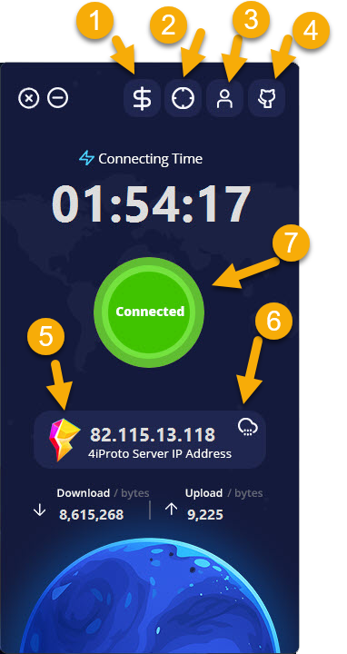

# Abdal 4iProto Client

**Secure, Fast, and Smart SSH Tunneling — Abdal 4iProto Client: Your Personal Gateway to Encrypted Internet Access**

  

## 📘 Other Languages

- [🇮🇷 Persian - فارسی](README.fa.md)

---

Abdal 4iProto Client is a cross-platform, high-speed, and ultra-secure GUI-based client built on the custom 4iProto protocol (SSH-based). It is designed to connect to Abdal 4iProto Server and automatically create a local SOCKS5 proxy (default port: 52905) for secure internet tunneling.

---

## 🚀 Features

- 🔐 **SSH-based 4iProto Protocol**: Fully encrypted and secure.
- 🌐 **SOCKS5 Proxy Server**: Automatically starts on successful connection (default port: `52905`).
- 🖥️ **Modern UI**: Beautiful interface with real-time monitoring.
- 💻 **Windows Support**: Fully compatible with Windows systems.
- ⚙️ **No Save Required**: All settings like exceptions are saved instantly.
- 🚫 **Proxy Exception List**: Automatically skip selected sites from tunneling.
- 📊 **Live Monitoring**: Track connection time and traffic.
- 🔄 **One-Click Connect/Disconnect**: Effortless control.
- 👨‍💻 **Developer Contact & GitHub Shortcut**: Embedded in the interface.
- 💰 **Built-in Donation Page Access**: Support further development.

---

## 🧩 UI Elements Guide

  

1. **Donation**: Opens the support/donation page  
2. **Monitoring**: Shows traffic and connection status  
3. **About/Contact**: Info about developer and contact links  
4. **GitHub**: Opens the GitHub project repository  
5. **Server Configuration**: Input for Abdal 4iProto Server IP and set local proxy port  
6. **Proxy Exceptions**: Add domains that should bypass the proxy  
7. **Connect/Disconnect**: Toggle VPN tunnel status  

---

## 📥 Installation

The application includes a multilingual Setup wizard.  
Please download and install the latest version from the following link:  
👉 [Download from GitHub Releases](https://github.com/ebrasha/abdal-4iproto-client/releases)

---

## 🛠️ How It Works

After installing and running the application

1. Connects securely to the specified Abdal 4iProto Server.
2. Starts a local SOCKS5 proxy server.
3. Routes all system traffic through the encrypted SSH tunnel.
4. Skips domains entered in the exception list.

---

 

## 🐛 Reporting Issues
If you encounter any issues or have configuration problems, please reach out via email at Prof.Shafiei@Gmail.com. You can also report issues on GitLab or GitHub.

## ❤️ Donation
If you find this project helpful and would like to support further development, please consider making a donation:
- [Donate Here](https://alphajet.ir/abdal-donation)

## 🤵 Programmer
Handcrafted with Passion by **Ebrahim Shafiei (EbraSha)**
- **E-Mail**: Prof.Shafiei@Gmail.com
- **Telegram**: [@ProfShafiei](https://t.me/ProfShafiei)

## 📜 License
This project is licensed under the GPLv2 or later License. 
